Image retrieval system for my self-hosted photo gallery engine.

One day I decided to build a photo gallery. I realized pretty quickly that "dumb" photo gallery is not a very interesting project, so I began to think about how to make it "smarter". Search is a really cool idea, I began my research and fell into the rabbit hole of [image retrieval](https://en.wikipedia.org/wiki/Image_retrieval).

I've created a set of microservices, which can be used for reverse image search/similar image search or tasks like tagging/image captioning. ~~I tried to keep it simple, so people could understand how it works just by looking at the code and easily make any changes they want.~~ Well, I looked at the code again, sometimes it's super confusing, I hope it's readable enough to modify it. 

current microservices:
- [phash_web](https://github.com/qwertyforce/phash_web)
- [color_web](https://github.com/qwertyforce/color_web)
- [local_features_web](https://github.com/qwertyforce/local_features_web)
- [global_features_web](https://github.com/qwertyforce/global_features_web)
- [image_text_features_web](https://github.com/qwertyforce/image_text_features_web)
- [image_caption_web](https://github.com/qwertyforce/image_caption_web)
- [places365_tagger_web](https://github.com/qwertyforce/places365_tagger_web)
- text_web (not released yet) 

In the text below, I will try to briefly explain how they work, show search examples, runnable examples (Google Colab), links for further reading, and various tips/tricks.
If you want to read about the photo gallery, click [here](https://github.com/qwertyforce/scenery/blob/master/how_it_works_scenery.md)


Tip: All microservices use Pillow for image resizing, so you can use [Pillow-SIMD](https://python-pillow.org/pillow-perf/) as a drop-in replacement for Pillow. 

>The results show that for resizing Pillow is always faster than ImageMagick, Pillow-SIMD, in turn, is even faster than the original Pillow by the factor of 4-6. >In general, Pillow-SIMD with AVX2 is always 16 to 40 times faster than ImageMagick and outperforms Skia, the high-speed graphics library used in Chromium.  
(https://github.com/uploadcare/pillow-simd)  

Web framework: FastAPI with  Uvicorn as an ASGI. This is a very convenient combination for this kind of project because FastAPI is light and easy to use, with built-in Swagger, which makes development more convenient.
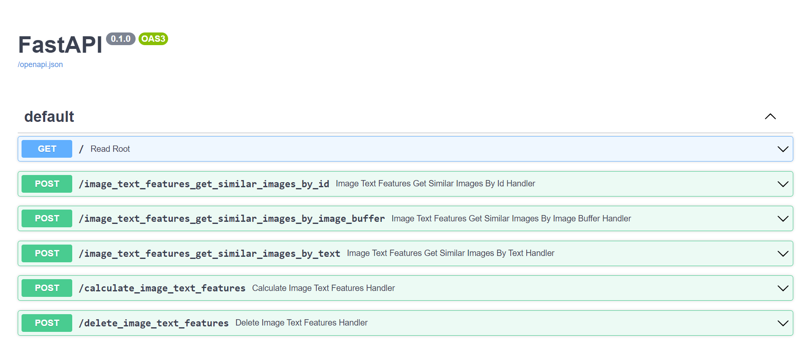


phash_web, color_web, local_features_web, global_features_web, image_text_features_web use [LMDB](https://en.wikipedia.org/wiki/Lightning_Memory-Mapped_Database) to store features on disk and use [FAISS](https://github.com/facebookresearch/faiss) for constructing a search index.  
 Previously, I used sqlite for storing numpy arrays, but it turned out to be extremely slow, because of the cost of serialization of numpy arrays (to bytes). LMDB, on the other hand, can write/read raw bytes from a memory-mapped file, it even can bypass unnecessary copying by the kernel.
 >Since LMDB is memory mapped it is possible to access record data without keys or values ever being copied by the kernel, database library, or application. To exploit this the library can be instructed to return buffer() objects instead of byte strings by passing buffers=True
 (https://lmdb.readthedocs.io/en/release/#buffers)


# phash_web
[[Colab](https://colab.research.google.com/github/qwertyforce/image_search/blob/main/phash_new.ipynb)]  
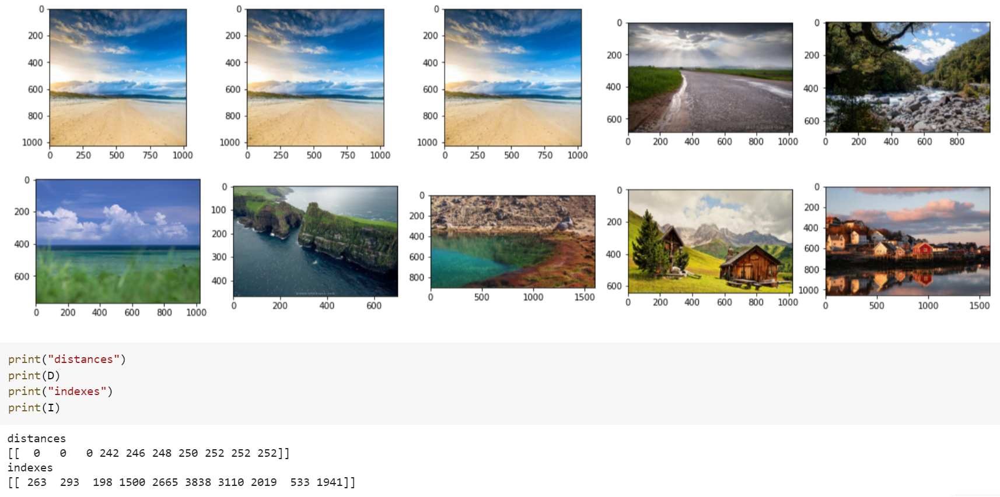  
Supported operations: add, delete, get similar by image id, get similar by image.

> Perceptual image hash functions produce hash values based on the image’s
visual appearance. A perceptual hash can also be referred to as e.g. a
robust hash or a fingerprint. Such a function calculates similar hash values
for similar images, whereas for dissimilar images dissimilar hash values are
calculated. Finally, using an adequate distance or similarity function to
compare two perceptual hash values, it can be decided whether two images
are perceptually different or not. Perceptual image hash functions can be
used e.g. for the identification or integrity verification of images.   
(https://www.phash.org/docs/pubs/thesis_zauner.pdf, page 12)  

There are a lot of various perceptual hashing algorithms, such as aHash, dHash, wHash, and pHash (You can check their implementations in python library 
[ImageHash](https://github.com/JohannesBuchner/imagehash)).  
Usually, Hamming distance is used for comparing these hashes. Less distance -> probability of images being the same is higher (false positivities still can occur).  
PDQ Hash (https://github.com/faustomorales/pdqhash-python) - is a hashing algorithm designed by Facebook, inspired by pHash, with some optimizations, like bigger hash size, usage of Luminance instead of greyscale, and others.
As well put in the PDQ paper, there are syntactic and semantic methods of hashing images:  
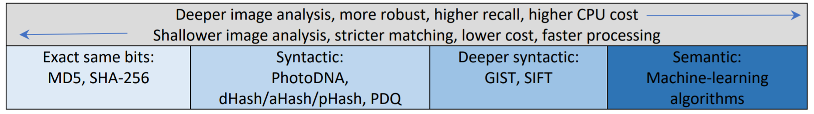  

>TMK+PDQF and PDQ are syntactic rather than semantic hashers. Algorithms in the latter category detect features
within images, e.g. determining that a given image is a picture of a tree. Such algorithms are powerful: they can
detect different photos of the same individual, for example, by identifying facial features. The prices paid are
model-training time and a-priori selection of the feature set to be recognized. For copy-detection use cases, by
contrast, we simply want to see if two images are essentially the same, having available neither prior information
about the images, nor their context.  
(https://github.com/facebook/ThreatExchange/blob/main/hashing/hashing.pdf)

Although PDQ is potentially better than phash, I used phash DCT with 576 bit hash size, because it seems, that PDQ is less sensitive than phash. On the image below we can see, that hamming distance between these images is 22 for PDQ and 110 for phash.  
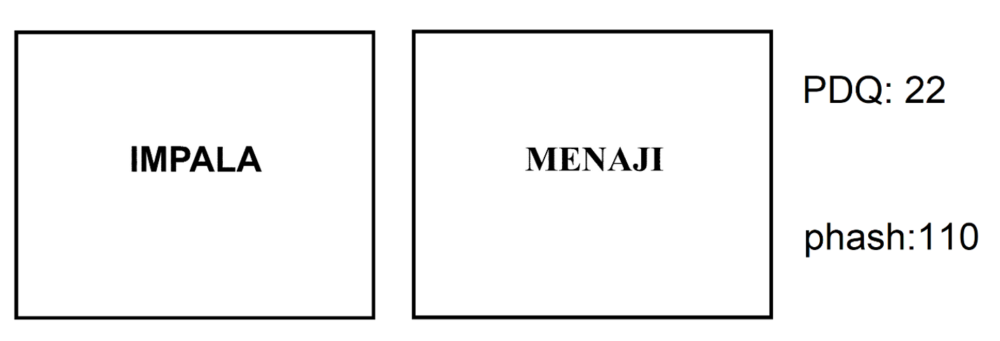  

I rewrote phash code from ImageHash library(https://github.com/JohannesBuchner/imagehash/blob/master/imagehash.py#L197), which was implemented by this article https://hackerfactor.com/blog/index.php%3F/archives/432-Looks-Like-It.html.
Let's go step by step with code examples:  
Step 1 Reduce color  
Step 2 Reduce size  
Step 3 Compute the DCT  
Step 4 Reduce the DCT  
Step 5 Compute the average value  
Step 6 Further reduce the DCT (make binary)  
Step 7 Construct the hash  
```python
@jit(cache=True, nopython=True)
def bit_list_to_72_uint8(bit_list_576):
    uint8_arr = []
    for i in range(len(bit_list_576)//8):    #here we convert our list of booleans into list of uint8 numbers (Boolean -> bit -> number)
        bit_list = []
        for j in range(8):
            if(bit_list_576[i*8+j] == True):
                bit_list.append(1)
            else:
                bit_list.append(0)
        uint8_arr.append(bit_list_to_int(bit_list)) # convert list of 1's and 0's to a number and append it to array
    return np.array(uint8_arr, dtype=np.uint8)

@jit(cache=True, nopython=True)
def bit_list_to_int(bitlist):
    out = 0
    for bit in bitlist:
        out = (out << 1) | bit
    return out

@jit(cache=True, nopython=True)
def diff(dct, hash_size):
    dctlowfreq = dct[:hash_size, :hash_size] #Step 4 Reduce the DCT
    med = np.median(dctlowfreq) #Step 5 Compute the average value
    diff = dctlowfreq > med  #Step 6 Further reduce the DCT (make binary). This will produce list of booleans. if element in dctlowfreq is higher than median, it will become True,if else, it will become False
    return diff.flatten()

def fast_phash(resized_image, hash_size):
    dct_data = dct(dct(resized_image, axis=0), axis=1) #Step 3 Compute the DCT  
    return diff(dct_data, hash_size)

def read_img_buffer(image_buffer):
    img = Image.open(io.BytesIO(image_buffer))
    if img.mode != 'L':
        img = img.convert('L') # Step 1, convert to greyscale
    return img

def get_phash(image_buffer, hash_size=24, highfreq_factor=4): # ENTRY POINT
    img_size = hash_size * highfreq_factor
    query_image = read_img_buffer(image_buffer) #<- Step 1
    query_image = query_image.resize((img_size, img_size), Image.Resampling.LANCZOS) #Step 2, Reduce size
    query_image = np.array(query_image)
    bit_list_576 = fast_phash(query_image, hash_size) #<- Steps 3,4,5,6
    phash = bit_list_to_72_uint8(bit_list_576) #<- Step 7 Construct the hash
    return phash
```
In the code above we used decorator @jit, which is provided by [Numba](https://github.com/numba/numba). Everyone knows that python is a slow language, so in order to speed up our computations, we want to off-load as many cpu-bound operations as possible to C-lang libraries like numpy, scipy, numba, etc. Numba is a just-in-time compiler, which runs code outside of python interpreter, thus making it significantly faster.  
To exploit the fact that most modern systems have more than 1 core, we can use multiprocessing libraries, like [joblib](https://joblib.readthedocs.io/en/latest/). Joblib allows us to use more than 1 core of CPU with just a single line.  
```python
phashes = Parallel(n_jobs=-1, verbose=1)(delayed(calc_phash)(file_name) for file_name in batch)
```
Phash is robust to minor transformations such as artifacts of jpeg compression, minor blur/noise, and same image, but in lower/higher resolution (for example, original image and thumbnail).

Example: hamming distance between these 2 images is 4. From my observations, similar images have distance <= 64.
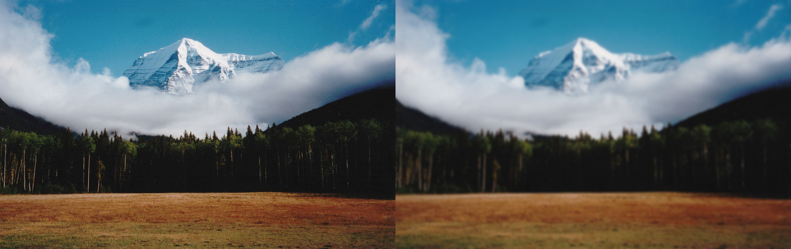  
 
Pros:  
- hash has a small size (576 bit or 72 bytes, 72 MB for 1 million images)  
- can be calculated very quickly  
- search is fast  
- using an optimal threshold value, there are not a lot of false positives 

Cons:  
- unstable to geometric transformations (for example, cropping, mirroring, rotations): gives a totally different hash.

To make the search more resilient to these transformations, at search time we can search not only with phash of the original image but also with modified versions of the image: mirrored or rotated. In the microservice mirroring of the original image is used to address this problem. 

# color_web
[[Colab](https://colab.research.google.com/github/qwertyforce/image_search/blob/main/rgb_hist_new.ipynb)]

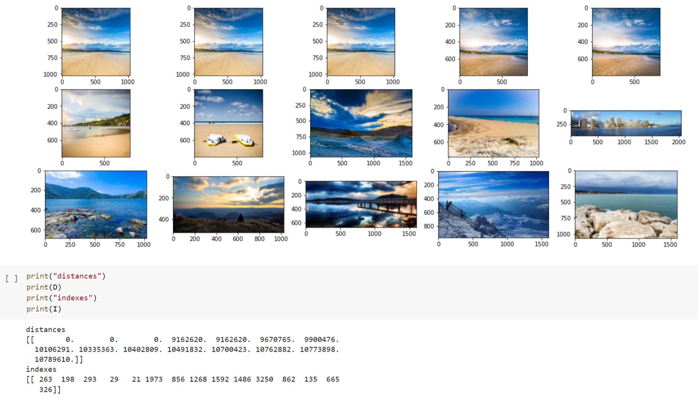  

Supported operations: add, delete, get similar by image id, get similar by image.

Let's compare rgb histograms (color distributions) of 2 images:

<table width="100%">
  <tr>
    <td width="33%">image</td>
    <td width="33%">rgb histogram 256 bins</td>
    <td width="33%">rgb histogram 8 bins</td>
  </tr>
  <tr>
    <td width="33%"></td>
    <td width="33%">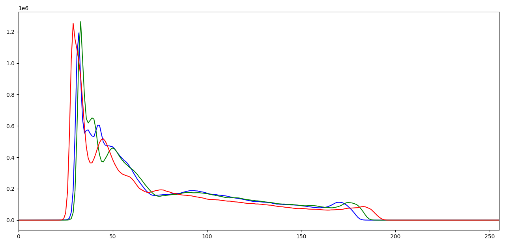</td>
    <td width="33%">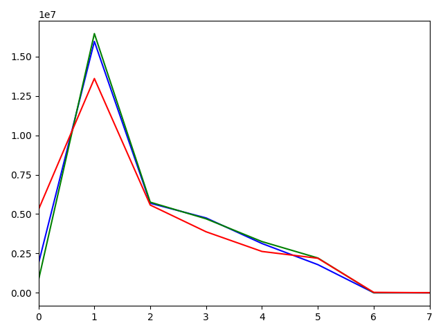</td>
  </tr>
  <tr>
    <td width="33%"></td>
    <td width="33%">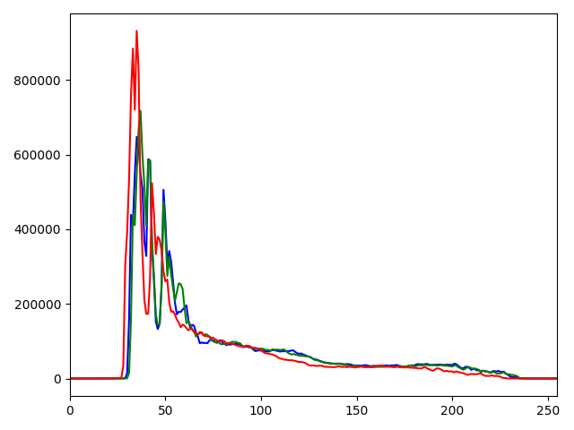</td>
    <td width="33%">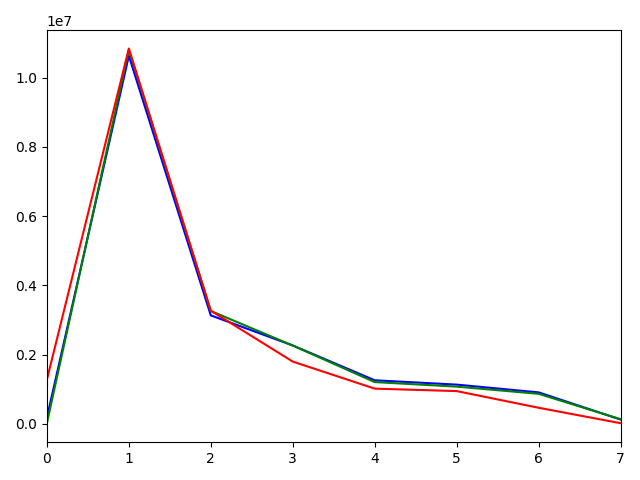</td>
  </tr>
  <tr>
    <td width="33%">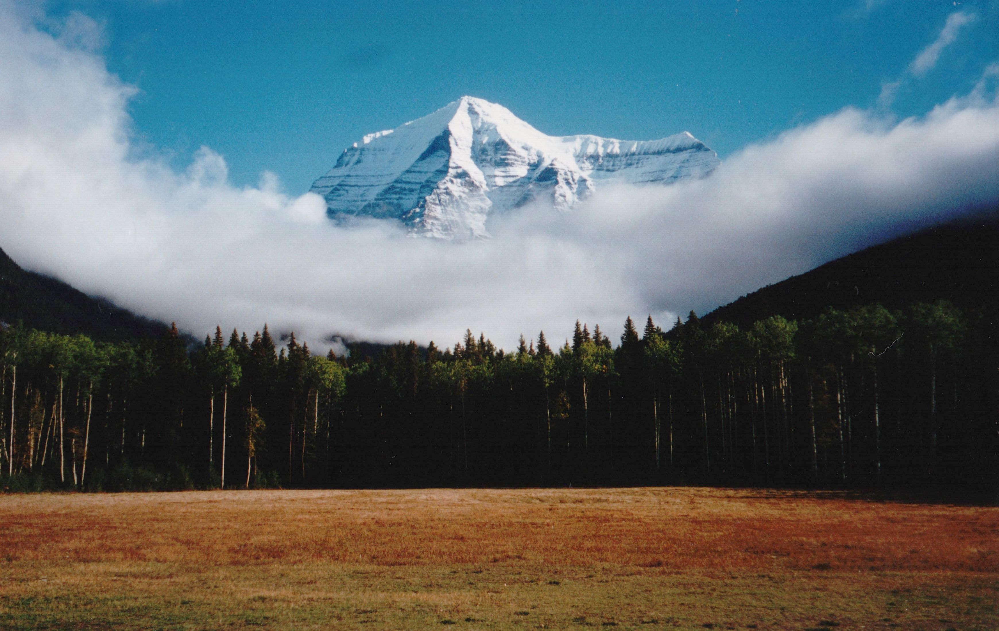</td>
    <td width="33%">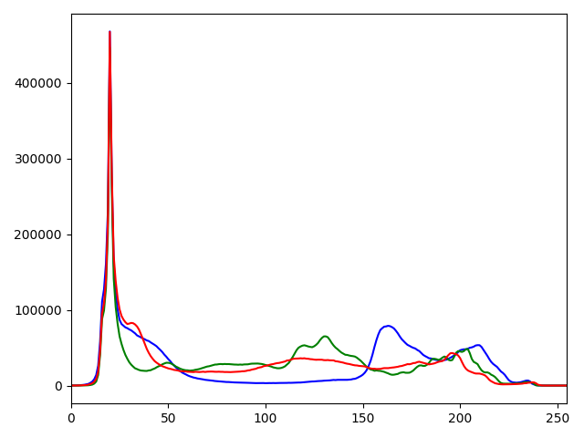</td>
    <td width="33%">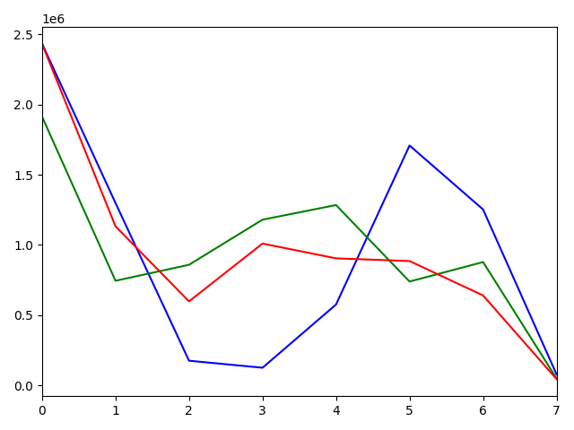</td>
  </tr>
</table>

You can see, that image 1 and 2 have a similar color palette and their rgb histograms are also similar!
To compare histograms of images with different sizes, we must flatten NxNxN matrix (N - number of bins) to a vector and then normalize it by dividing each bin by the total amount of pixels in the image. Also, we will use 8 bin histograms, because the size is less. 256 bin histogram will have a size of (256^3)*4 ~ 67 MB. 
8 bin histogram is just (8^3)*4 ~ 2 KB.

```python
def get_features(query_image):
    query_hist_combined = cv2.calcHist([query_image], [0, 1, 2], None, [8, 8, 8], [0, 256, 0, 256, 0, 256])
    query_hist_combined = query_hist_combined.flatten()
    query_hist_combined = query_hist_combined*10000000
    query_hist_combined = np.divide(query_hist_combined, query_image.shape[0]*query_image.shape[1], dtype=np.float32)
    return query_hist_combined
```
We use OpenCV for calculating histograms (way faster than pure python, although i did not benchmark numba&&numpy version, maybe it's faster than opencv). 
We can try to measure the similarity between histograms using distance functions like Correlation or Intersection (https://docs.opencv.org/3.4/d8/dc8/tutorial_histogram_comparison.html).
Unfortunately, it's not quite suitable for our case: we want to make it really fast, so let's see what distance functions Faiss [provides](https://github.com/facebookresearch/faiss/wiki/MetricType-and-distances).
I did some testing and got the best results (visually, subjectively) using L1 distance.  
Github's markdown doesn't support Latex, so let's write L1 distance as a python function.
```python
def l1(a,b):
    res = 0
    for a_i, b_i in zip(a,b):
        res+=abs(a_i-b_i)
    return res
# l1([1,2],[3,4]) == 4
```
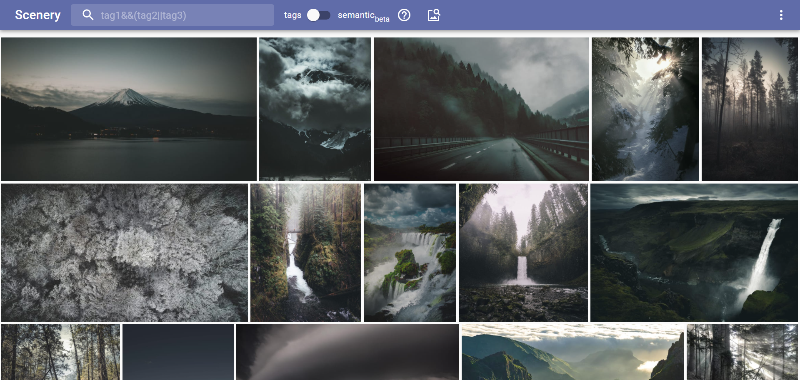  

Pros:  
- Resistant to transformations that do not significantly change the histogram of the image
- can be calculated very quickly  
- More resistant to crop than phash  

Cons:  
- Big memory consumption (1 million of rgb histograms with 8 bins will have a size of 2 GB)
- Takes into account only colors, does not take into account geometry

# local_features_web
[[Colab](https://colab.research.google.com/github/qwertyforce/image_search/blob/main/local_features.ipynb)]  
P.S Colab version doesn't use keypoint detection method from the text, it's just finding top 200 keypoints (I am too lazy to adjust the code).  
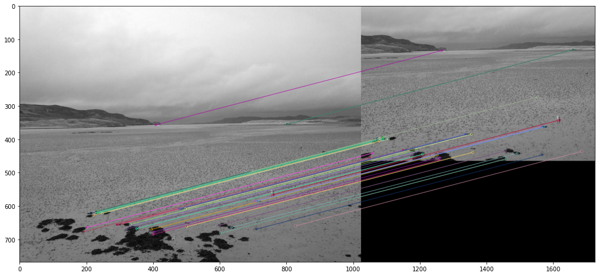  

Supported operations: add, delete, get similar by image id, get similar by image.
>Local features refer to a pattern or distinct structure found in an image, such as a point, edge, or small image patch. They are usually associated with an image patch that differs from its immediate surroundings by texture, color, or intensity. What the feature actually represents does not matter, just that it is distinct from its surroundings. Examples of local features are blobs, corners, and edge pixels.
(https://www.mathworks.com/help/vision/ug/local-feature-detection-and-extraction.html)

The whole process can be divided into two steps  
1. Detection of keypoints
2. Calculating descriptors of keypoints

Detector: DoG (SIFT)   
Descriptor: [HardNet8](https://arxiv.org/pdf/2007.09699.pdf) from [Kornia](https://kornia.readthedocs.io/en/latest/index.html) library. 
  
This microservice is primarily used for finding crops of images. The idea is simple: we detect keypoints in image 1, then we calculate descriptors of these keypoints. We repeat it for image 2 and then compare descriptors (L2 distance is used). Similar descriptors == Similar regions in images.  
There are a lot of problems with this method.  

The first problem is that by default, detectors will find keypoints, which are the most resilient to various transformations. One can think that there is nothing bad about it, but the thing is, these keypoints tend to be located in groups, they don't cover large portions of an image, but we want them to be located more sparsely so that we could find crops.  
Here is an image of the top 200 keypoints detected by SIFT (green point == keypoint).
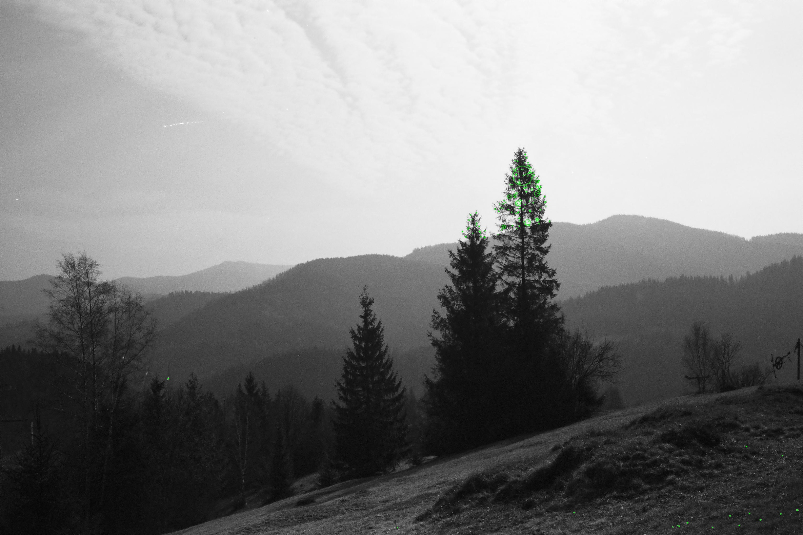  
We can try to divide the image into 4 quadrants and find top 50 keypoints in each.
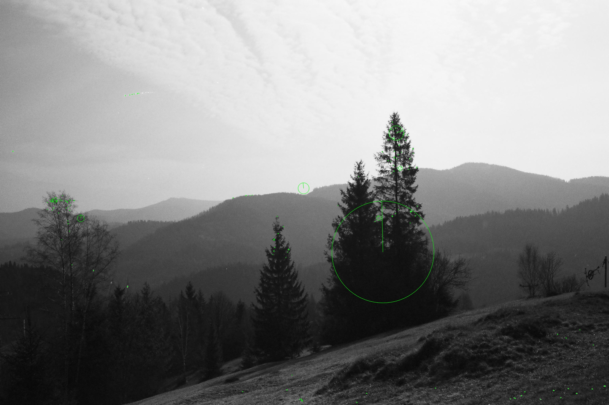  

That's better, as you can see, the leftmost tree got some keypoints too! But we can go a little bit further and impose a limit: a keypoint can't have more than 3 neighbors in a 50px radius. We will achieve this by keeping the coordinates of keypoints we choose and finding L2 distance between a new keypoint and those we choose. If distance is < 50, we will keep it, if else we will ignore it and check next.  
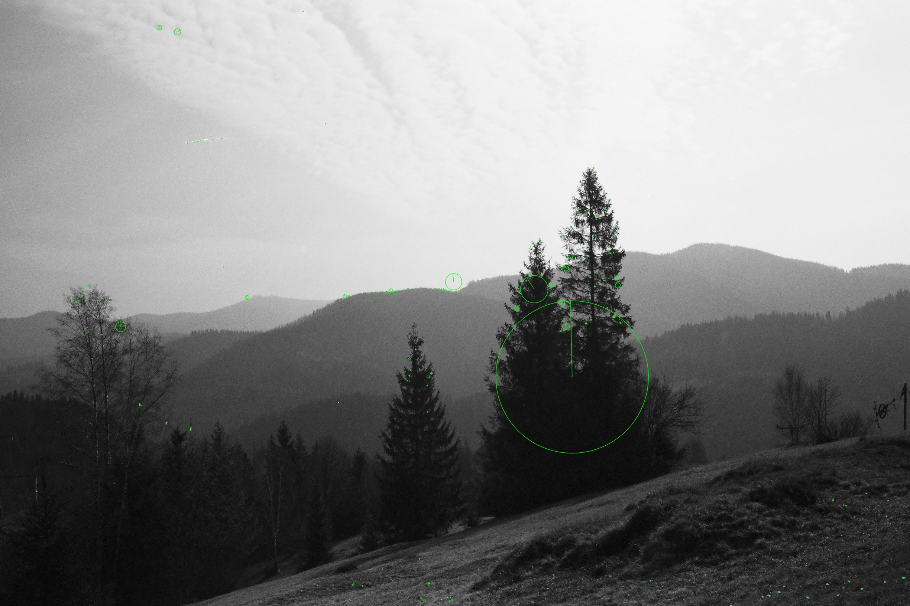  

The second problem is that HardNet8 uses 512 bytes (128 floats32) for 1 descriptor (descriptors like ORB or AKAZE use less, but they are less accurate). About 200 keypoints/descriptors is an okay number of descriptors, which gives us 102.4 KB per image, 102.4 GB per million. Bruteforcing through this would be very painful and you have to keep it in ram to make it fast.  

In order to speed up the search, it is necessary to carry it out in RAM, and for this, it is necessary to reduce the amount of memory occupied by vectors. This can be achieved by quantizing them. Quantization of vectors allows you to significantly reduce the size of the vector. To do this, the PQ (Product Quantization) approach is used, as well as an optimization that increases the accuracy of compressed vectors – OPQ (Optimized Product Quantization).

The IVF index(Inverted File Index) is a method of Approximate nearest neighbor search (ANN). It allows you to “sacrifice” accuracy in order to increase search speeed. It works according to the following principle: using the K-Means algorithm, there are K clusters in a vector space. Then, each of the vectors is added to the cluster closest to it. At search time, bruteforce compares only the vectors located in the ```nprobe``` of the closest clusters to the vector we use for the search. This allows you to reduce the search area. By adjusting the nprobe parameter, you can influence the ratio of speed and accuracy, the higher this parameter, the more clusters will be checked, respectively, the accuracy and search time become longer. Conversely, when this parameter decreases, the accuracy, as well as the search time, decreases.

After the search is done, we want to know which descriptors belong to which image. To make this possible we have to keep a relation between image_id and ID of a keypoint/descriptor. Keypoint and corresponding descriptor get a sequential id. 
I tested the performance of sqlite, python library which implements Interval Tree, and PostgreSQL Gist Index. The numbers below are for about 800_000 keypoints/descriptors.
| method                | requests per second | RAM consumption, MB |
|-----------------------|---------------------|---------------------|
| SQLite                | 50                  | 0                   |
| PostgreSQL gist index | 6000                | < 100               |
| Interval Tree         | 50000               | 500                 |
 
I choose to go with PostgreSQL because it has acceptable performance (this lookup stage is not the most time consumptive part of a search) and low memory consumption. This is how it looks like in pdAdmin  
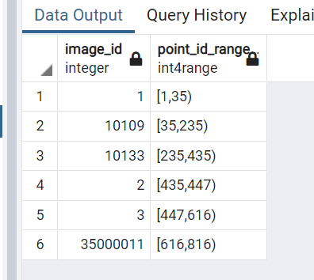  

There is a lot of noise in the search results, we get a lot of false-positive results. We can refine our search results by using bruteforce on image descriptors from the previous step. This is how this pipeline works:
1. Find similar descriptors using Faiss index
2. Get image ids from vector ids using PostgreSQL index
3. Extract original keypoints and descriptors of these images from LMDB
4. Use bruteforce matching (smnn in our case) to get more accurate results.
5. Use RANSAC (MAGSAC++ from OpenCV) to get rid of outliers.

  

Pros:  
- can find crops

Cons:  
- Unscalable (1M images => 100 GB of features, index is ~15-18 GB)
- Slow (i5 4570, ~20 seconds for a search, )
- Can't find an image if it's mirrored (this can be solved by performing a search on both original and mirrored versions but it's will be painfully slow)
- Can't find an image if it's downscaled too much (it can't find originals by thumbnails :( , I don't know if this issue can be solved without sacrificing search speed)

# global_features_web
[[Colab](https://colab.research.google.com/github/qwertyforce/image_search/blob/main/global_features.ipynb)]

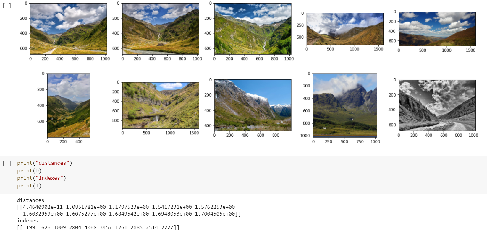  

Supported operations: add, delete, get similar by image id, get similar by image.
>Recent results indicate that the generic descriptors extracted from the convolutional neural networks are very
powerful. This paper adds to the mounting evidence that
this is indeed the case. We report on a series of experiments conducted for different recognition tasks.  
...  
 The
results strongly suggest that features obtained from deep
learning with convolutional nets should be the primary candidate in most visual recognition tasks.  
(https://arxiv.org/pdf/1403.6382.pdf, page 1) //2014 btw

Indeed, features extracted with the help of neural networks are a good baseline for an image retrieval system.  
I did some tests, and it seems, that features extracted from vision transformers, which were trained on imagenet-21k, work better than the ones extracted from CNN-based networks.
I tested various variants of ViTs and the best results are shown by BEiT. That's why this microservice uses BEiT.  
As usual, given the distance metric, we can measure how much one image is different from the other. But this time model takes into account not only visual similarity but also semantics of an image.

I googled for some tricks to make search more accurate. I found these two: PCAw (PCA Whitening) and αQE and applied them.

PCAw:
1. Train pcaw on our dataset
2. Apply pcaw to the dataset
3. ???
4. Through the magic of Mathematics, search results become better!  

In the paper [Negative evidences and co-occurrences in image
retrieval: the benefit of PCA and whitening](https://hal.inria.fr/hal-00722622v2/document) it's explained why this works <sup><sub>(i didn't understand)</sub></sup>  

Another trick is to use *alpha* Query Expansion:
1. Get results from a search query
2. Get features of top-n results
3. Combine them into one averaged vector, taking into account how similar is the vector we used for the initial search and vector from top-n results. Alpha lets you control this process.
4. You can now use this new feature for a new search query

```python
def get_aqe_vector(feature_vector, n, alpha):
    _, I = index.search(feature_vector, n) # step 1
    top_features=[]
    for i in range(n): # step 2
        top_features.append(index.reconstruct(int(list(I[0])[i])).flatten())
    new_feature=[]
    for i in range(dim): # step 3
        _sum=0
        for j in range(n):
            _sum+=top_features[j][i] * np.dot(feature_vector, top_features[j].T)**alpha
        new_feature.append(_sum)
    new_feature=np.array(new_feature)
    new_feature/=np.linalg.norm(new_feature)
    new_feature=new_feature.astype(np.float32).reshape(1,-1)
    return new_feature
```
This method was described [in this paper](https://arxiv.org/pdf/1711.02512.pdf) (page 6, 3.2). 

By default Faiss Flat(bruteforce) is used, because these features are fast to search and are lightweight, perfect for small datasets. Though, PQ index training script is included, just in case.

Pros:  
- Search is fast
- Size is small (768*4 = 3072 bytes per feature, 3 GB per million)
- Size can be smaller if you train PQ index (3 GB of features can be converted to 256 MB with no big loss in search quality)
- Can be fine-tuned to work better on your data (I haven't gotten to that yet)

Cons:
- Can't find crops
- Model trained on imagenet-21k may not suit you
# image_text_features_web
[[Colab](https://colab.research.google.com/github/qwertyforce/image_search/blob/main/image_text_features.ipynb)]  
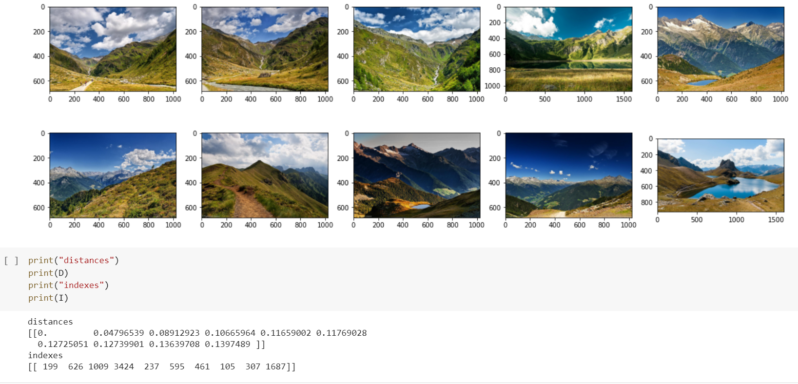  

>Zero-shot CLIP is
also competitive with the current overall SOTA for the task
of text retrieval on Flickr30k. On image retrieval, CLIP’s
performance relative to the overall state of the art is noticeably lower. However, zero-shot CLIP is still competitive
with a fine-tuned Unicoder-VL. On the larger MS-COCO
dataset fine-tuning improves performance significantly and
zero-shot CLIP is not competitive with the most recent work.
For both these datasets we prepend the prompt “a photo
of” to the description of each image which we found boosts
CLIP’s zero-shot R@1 performance between 1 and 2 points.  
(https://arxiv.org/pdf/2103.00020.pdf, page 45)

Everything is the same as in global_features_web, but instead of BEiT, clip vit-B/16 is used. PCAw is disabled, because it breaks text to image search. 
Currently, CLIP ViT B/16 is used, but generaly this microservice is for any model, capable of generating embedding for images and for text in the same latent space, which means that we can compare image embedding to text embeddings! This gives us the ability to compare images and text. This is how semantic search is implemented in the photo gallery.  

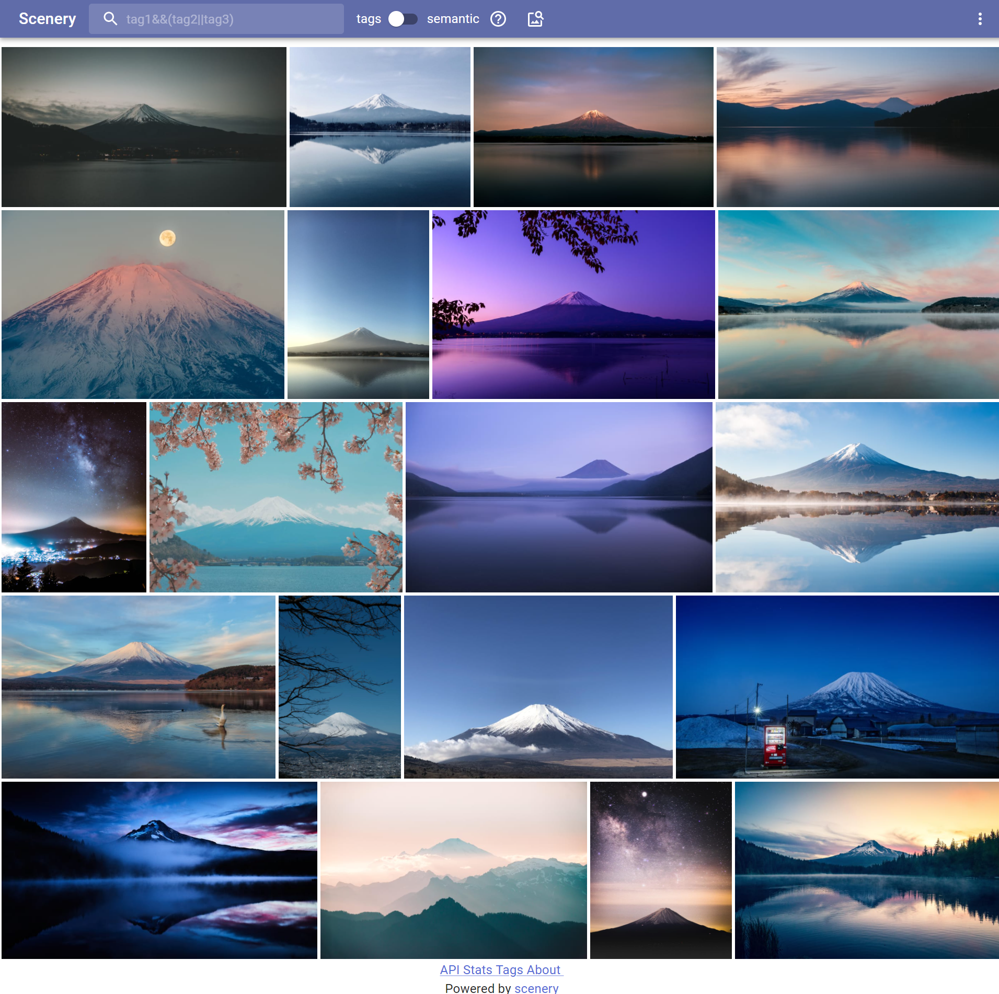  

Search by text:  
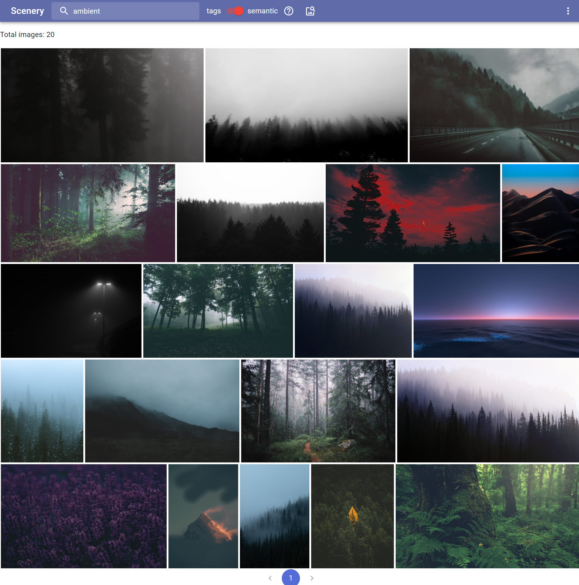  

Pros:
- dual purpose models are awesome, can do image-to-image and text-to-image search with the same image features 

Cons:
- idk if it can be finetunened 
- [clip fixates on text](https://i.imgur.com/Jm7bRV3.png)

# image_caption_web
[[OFA Github](https://github.com/OFA-Sys/OFA)] [[Official OFA Colabs](https://github.com/OFA-Sys/OFA/blob/main/colab.md)] [[Official HuggingSpace demo](https://huggingface.co/spaces/OFA-Sys/OFA-Image_Caption)]  

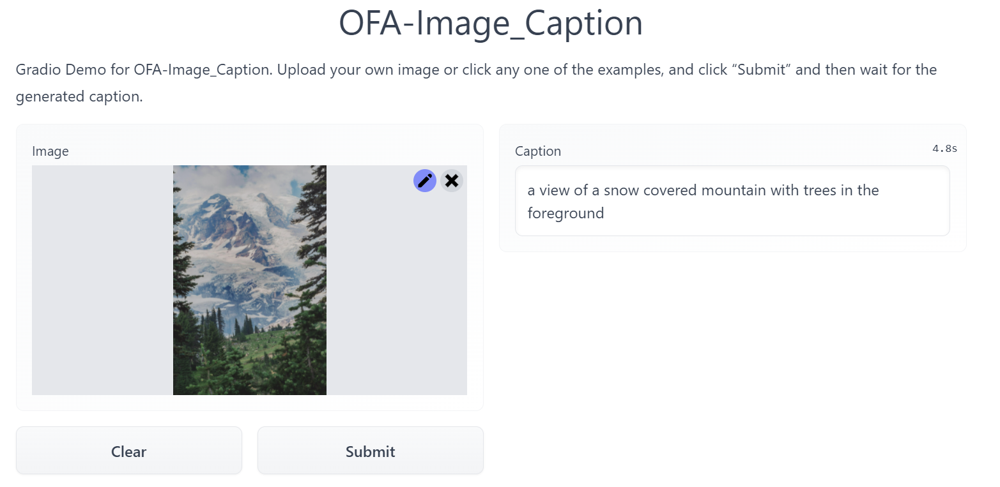  

In the photo gallery, it's used to generate titles of images.  
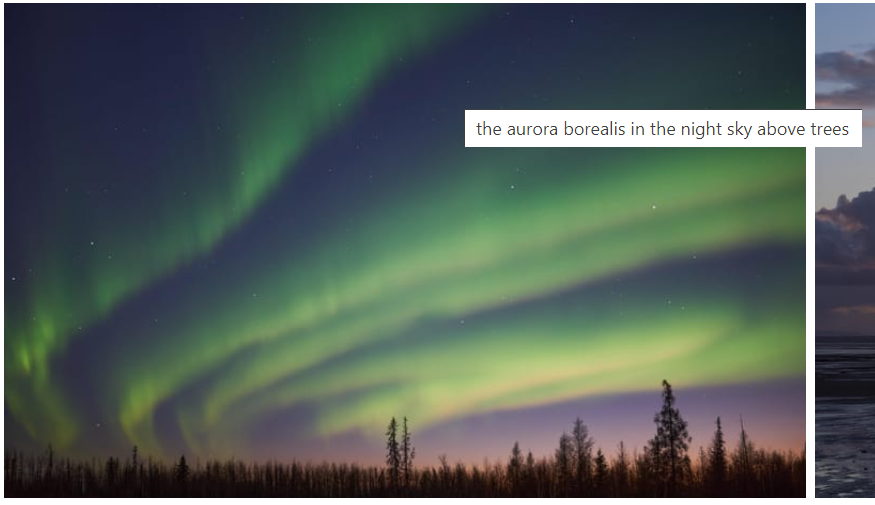  
Pros:
- Descriptions are really good in comparison to other models  

Cons:
- Consumes up to 8GB of RAM at the start, then it drops to ~2GB
- Consumes ~5GB of VRAM if you use GPU
- Slow performance on cpu (on i5 4570 it takes about 7 seconds)

# places365_tagger_web  
[[Official Places365 Demo]](http://places2.csail.mit.edu/demo.html)  
 

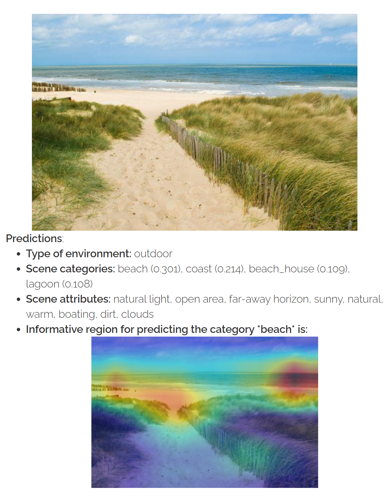  

Generates tags, that are later used in a "search by tags" in photo gallery. Resnet-50 trained on Places365.

Pros:
- Generates useful tags

Cons:
- Sometimes can be inaccurate
- Model was trained on Places365, probably wasn't trained on tags you might want.

# text_web 
Main idea: OCR text -> save original and metaphone'd versions of text to PostrgreSQL -> use Levenshtein distance to find images with similar looking/sounding text.  
WIP (Trying to find a way to get a decent result in comparing words from different languages, no luck yet :|, maybe something like a universal phonetic alphabet is a good idea...)
# ambience
Ambience is an API Gateway for all these microservices, which proxies/unites them. For example: to calculate all features you need, you can send a request to ambience which in turn sends requests to other microservices, instead of using microservices directly. That helps in separating image search logic and photo gallery logic.
Ambience is built with Node.js and fastify. For proxifing requests, [fastify-reply-from](https://github.com/fastify/fastify-reply-from) is used, which uses [undici](https://www.npmjs.com/package/undici) as an http client, that is significantly faster than built-in http client provided by node.js. Also, in /reverse_search endpoint you can merge search results from different microservices, building a more relevant search. As an example, simple logic: if image occurs in search results of different microservices, it means that there's a big chance that this image is more relevant than others, so you can move it up in search results. 
#
As you can see image retrieval is such an interesting problem! 
I would say, that information becomes useful, only when you can perform a search, otherwise, it's just a pile of ones and zeros.

Github repository with colabs: https://github.com/qwertyforce/image_search  
If you found any inaccuracies or have something to add, feel free to submit PR or raise an issue.
